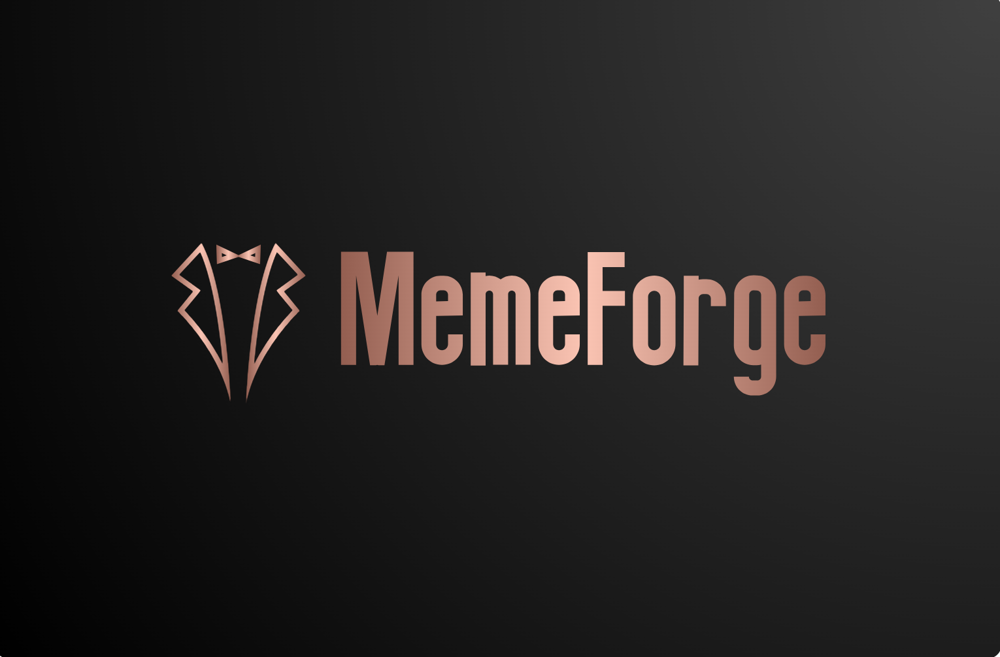

# MemeForge: Revolutionizing Meme NFTs with Web3 🎨

## Overview

MemeForge is a revolutionary Web3 platform that transforms meme creation and sharing into a decentralized, incentivized ecosystem. Built on Shape Network, it introduces novel concepts like GasBack rewards and NFT-gated features to create a sustainable meme economy.



## 🔗 Links

- [Live Site](https://memeforge-shape.vercel.app)

> ⚠️ **Note**: MemeForge is optimized for desktop viewing. For the best experience, please access the platform on a desktop or laptop computer.

## 🎯 Problem Statement

The meme ecosystem faces three critical challenges:

1. **Creator Attribution**: Original meme creators rarely receive credit or compensation when their work goes viral
2. **Gas Fee Barriers**: High transaction costs discourage participation in Web3 meme NFT creation
3. **Quality Control**: Lack of incentives for high-quality content and meaningful engagement

## 💡 Our Solution

MemeForge introduces a revolutionary platform that transforms meme creation into NFTs, building a sustainable creative economy through:

- **Verifiable Attribution**: Every meme NFT's history is tracked on-chain
- **GasBack Rewards**: Innovative system that reimburses gas fees for popular content
- **NFT-Gated Features**: Exclusive features ensure committed community participation

## 🎯 Quick Start for Judges

### Live Demo

1. Visit [https://memeforge-shape.vercel.app](https://memeforge-shape.vercel.app) on a desktop browser
2. Connect your Shape Network wallet
3. Create and interact with meme NFTs
4. Experience GasBack rewards system

> 💻 **Desktop Required**: The meme creation and editing features are currently optimized for desktop use. Mobile support is planned for future releases.

### Local Development

```bash
# Clone the repository
git clone https://github.com/ajag408/MemeForge.git

# Install dependencies
cd app
npm install

# Set up environment variables
cp .env.example .env
# Add your Shape Network RPC URL and private key

# Start the development server
npm run dev

# Open http://localhost:3000
```

### Key Features to Test

1. **Meme Creation**: Create your first meme NFT
2. **Social Interaction**: Like and vote on memes; remix memes
3. **NFT Gating**: Experience premium features with Key & Eye NFTs

## 🌟 Key Features

### Core Functionality

- **Create & Mint Memes**: Turn your creativity into meme NFTs
- **Remix System**: Build upon existing memes while preserving attribution
- **Social Engagement**: Like, vote, and remix mechanics
- **GasBack Rewards**: Innovative gas fee reimbursement system
- **NFT-Gated Features**: Exclusive features available through hodling Key & Eye NFTs

### Smart Contract Architecture

- **MemeForgeCore**: Main contract handling meme creation and social interactions

  - address: 0x09C111238F70a72F7768411372E3254b0aEdf8Ff
  - explorer: https://shapescan.xyz/address/0x09C111238F70a72F7768411372E3254b0aEdf8Ff
  - highlight collection: https://highlight.xyz/mint/shape:0x09C111238F70a72F7768411372E3254b0aEdf8Ff:e407d8690f0d663551fbdcce18d0cd35

- **MemeForgeGasBack**: Revolutionary gas reimbursement system
  - address: 0xeeb19F7efd2647eda5eE3EBdBe924f33168fB868
  - explorer: https://shapescan.xyz/address/0xeeb19F7efd2647eda5eE3EBdBe924f33168fB868

### 🌊 Viral Mechanics & On-Chain Engagement

### 1. Remix-to-Earn

- **Chain Reactions**: Each remix creates a new meme NFT while preserving the original creator's attribution
- **Royalty Streams**: Original creators earn from all subsequent remixes
- **Engagement Multipliers**: More remixes increase visibility and earning potential

### 2. GasBack Innovation

- **Activity Rewards**: Active creators receive gas fee reimbursements
- **Engagement Mining**: Likes, votes, and remixes contribute to GasBack earnings
- **Sustainable Loop**: More engagement → More GasBack → More meme NFT creation

### 3. Key & Eye Integration

- **Key NFT**: Unlocks AI-powered meme generation capabilities
- **Eye NFT**: Premium visibility and dynamic badge display
- **Status Symbols**: Eye badge shows platform influence

### 4. Social Actions = Real Value

- **Like-to-Earn**: Every like is an on-chain transaction that:

  - Increases meme NFT visibility
  - Contributes to creator's GasBack rewards
  - Affects trending algorithm ranking

- **Vote Power**: On-chain, NFT-gated voting mechanism that:
  - Amplifies content visibility
  - Generates GasBack rewards for quality content

### 5. Economic Incentives

- **Creators**: Earn from:

  - Direct meme NFT sales
  - Remix royalties (5%)
  - GasBack rewards
  - Future governance rights

- **Curators**: Earn through:
  - Early discovery bonuses
  - Voting rewards
  - Community reputation

### 6. Viral Amplification Loop

Create Meme NFT → Receive Engagement → Earn GasBack → Create More Meme NFTs → Repeat

- Each interaction generates on-chain events
- Events trigger GasBack accumulation
- More engagement = More rewards = More creation

## ⛽ GasBack Reward System

### Primary Distribution

1. ### Minting Rewards

   - **Original Creator**: 40% of gas spent

2. ### Like Rewards

   - **Original Creator**: 40% of gas spent
   - **Remixer**: 15% if meme is a remix

3. ### Vote Rewards

   - **Original Memes**:

     - Creator: 40% of gas spent

   - **Remixed Memes**:
     - Original Creator: 35% of gas spent
     - Remixer: 15% of gas spent

### Secondary Distribution

After primary rewards are distributed:

1. **Top Voted Meme**: 20% of remaining GasBack pool

### Claiming Process

- Rewards track automatically through smart contract
- Monthly distribution of top voted meme bonus
- No manual tracking required

## 🚀 NFT Integration & Interoperability

### Core NFT System

1. ### Creation NFTs (Memes)

   - **On-Chain Metadata**: Each meme is a fully on-chain NFT
   - **Provable History**: Complete lineage of remixes and interactions
   - **ERC-721 Standard**: Full compatibility with NFT marketplaces

2. ### Access NFTs

   - **Key NFT**:

     - Unlocks AI-powered meme generation service
     - Input text to generate custom meme images

   - **Eye NFT**:
     - Boosts holder's memes to top of all display lists
     - Displays exclusive Eye Holder badge on memes
     - Premium visibility in Featured/Trending sections

### Cross-Platform Utility

1. ### Gaming Integration

   - **Avatar Systems**: Meme NFTs usable as profile pictures in compatible games
   - **Achievement Displays**: High-engagement memes can unlock special game features

2. ### Metaverse Applications

   - **Virtual Galleries**: Display your meme NFT collection
   - **Interactive Exhibitions**: Create remix events in virtual spaces
   - **Social Spaces**: Use engagement metrics for status/access

3. ### DeFi Potential
   - **Collateral**: High-value meme NFTs usable in DeFi protocols
   - **Fractionalization**: Split ownership of popular memes
   - **Yield Generation**: Stake NFTs for additional rewards

## 🚀 Smart Account Integration

- Created smart account client with gas policy manager for sponsored transactions
- Current Development Status:
  - Basic integration complete
  - Pending implementation of:
    - Full sponsored transaction system
    - Secure login flow
    - Enhanced security measures

## 🚀 Future Roadmap

### Phase 1: User Experience & Onboarding

- **Smart Account Integration**
  - Full AccountKit implementation for frictionless onboarding
  - First 5 transactions sponsored by protocol
  - Easy private key export functionality
  - Sponsored GasBack claims for all users
- **Security & Anti-Bot**
  - Bot gating measures
  - Enhanced verification systems
  - Sybil resistance implementation

### Phase 2: Platform Enhancement

- **Creation Tools**
  - More robust meme creation interface
  - Advanced editing capabilities
  - Template management system
- **Automation & Dynamic NFTs**
  - ChainLink automation for GasBack distribution
  - Dynamic NFTs that evolve with popularity
  - Real-time engagement metrics
- **Social Features**
  - Share popularity tracking
  - Cross-platform integration
  - Enhanced social discovery

### Phase 3: Economic Expansion

- **Viral Investment System**
  - pump.fun-style meme investment
  - Token launch threshold mechanics
  - Creator/remixer revenue sharing
- **Enhanced Rewards**
  - Dynamic reward pools
  - Community-driven curation
  - Advanced tokenomics

## 💡 Innovation & Impact

### Web3 Social Innovation

- First platform to implement gas reimbursement for social content
- Novel approach to content ownership and attribution
- Sustainable creator economy model

### Technical Achievement

- Efficient smart contract architecture
- Optimized for Shape Network's capabilities
- Innovative use of NFT gating mechanics

### Community Value

- Empowers creators through ownership
- Incentivizes quality content creation
- Builds sustainable engagement loops

## 🛠 Technical Stack

### Frontend

- Next.js 13 with App Router
- Tailwind CSS for styling
- Ethers.js for blockchain interaction
- IPFS for decentralized storage

### Smart Contracts

- Solidity 0.8.20
- Hardhat development environment
- OpenZeppelin contract standards
- Custom gas optimization

## 🔒 Security

- Comprehensive smart contract testing
- Reentrancy protection
- Access control implementation
- Rate limiting mechanisms

## 📈 Market Potential

### Target Audience

- Meme creators and enthusiasts
- Web3 content creators
- Digital artists
- Social media influencers

### Growth Strategy

- Community-driven development
- Strategic partnerships
- Creator incentive programs
- Cross-platform integration

## 🏆 Achievements

- Built during ShapeCraft Hackathon
- Innovative implementation of GasBack system
- First meme platform on Shape Network

---

Built with ❤️ for the Shape Network Community
